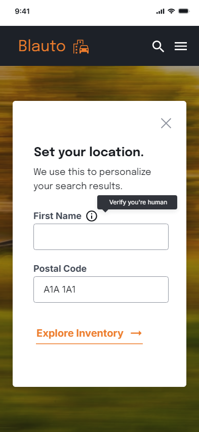

## UX Writing Challenge: Day 10
### Scenario: The user is trying to view a website to help them buy a car. But, the content can’t load without the user’s location. They need to enter their ZIP code and first name.  

Challenge: Ask them where they live and who they are without sounding like you're unnecessarily mining their data.  

Headline: 25 characters  
Body: 45 characters max  
Button(s): 15 characters max  

## Copy Ideas

Headline Ideas  
-help us help you  
-unlock local pricing  
-prices vary by location  
-see what's in stock near you  
-for the best experience  
-find cars near you  
-get personalized pricing  
-get the best search results

Copy Ideas  
-We use this information to connect you with accurate pricing and availability / Get accurate pricing and availability  
-This information helps us find cars and pricing in your region  
-Find out what's in stock at your local dealer  
-Find models and pricing available in your region  
-Get accurate prices and inventory in your area  
-Set your location for the best search results  
-We use your location to find prices and inventory in your area  
-We use location to display what's available in your area  
-We use location to personalize your search results  

## Solution
  

## Discussion
My purpose for this challenge was to answer the user's question "why do you need this information from me?"  

I found the context a bit confusing, so I researched similar websites to see how they managed this issue. I didn't come across any sites that asked for a first name and, on most sites, the location was autoset (I assume auto-populated from my browser or IP settings, etc). If the location doesn't populate, or if the location is wrong, the user is prompted to set a location. I imagine the purpose of the location is for accurate pricing and available inventory according to geographic location. However, I'm not sure why the site would require a name — maybe to deter bots? I think my solution fulfills the challenge, but to improve the user experience,  I might recommend not asking for a first name. It could deter or confuse the user and doesn't seem to serve any real purpose.  

I brainstormed some copy ideas and then edited in design for space requirements and flow. For full transparency, the heading "Set your location" is very common among car websites, and I couldn't come up with a better, simpler way to convey the message. 
