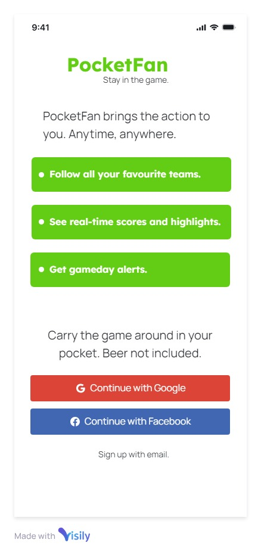
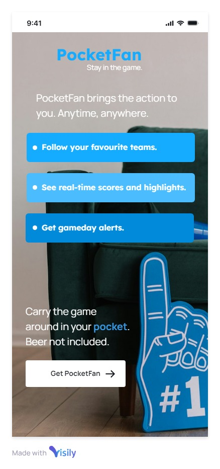
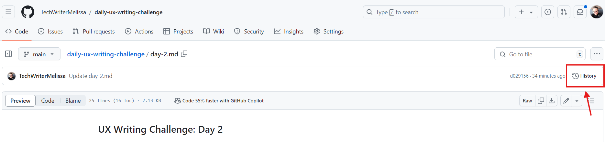

## UX Writing Challenge: Day 2
### Scenario: A user is a working parent, and a big sports fan, in the midst of their favorite sports season who can no longer attend games.

Challenge: Write a promotional screen for an app that lets a user choose teams, sends game reminders, real-time score updates and highlight videos.

Headline: 40 characters  
Body: 175 characters max  
Button(s): 25 characters max  

## Final Copy
**Carry the game around in your pocket.**  
PocketFan lets you follow the teams you love so you won't miss a thing. Stay in the game with real-time scores and highlights that bring you the action anytime, anywhere. Beer not included. 

## Solution

## Discussion
So this one initially tripped me up a bit, because I wasn't too sure what they meant by "promotional screen." I played with some different ideas, and then settled on some copy I thought met the challenge. My user is a busy parent who loves sports but isn't able to invest as much time as they used to in being a fan. They're looking for a way to keep track of their teams and feel connected and involved without watching every game. I kept the tone jovial while speaking to the user's sense of FOMO, and brought in some quippy, fun remarks. I acutally preferred the headline "Bring the game home with you." It was intended to be a play on the phrase *bring work home* with you, but it didn't quite fit with the name PocketFan so I changed it up slightly.  

I did a bit of digging and came to the conclusion — rightly or wrongly — that a promotional screen is what the user sees when they first download an app and before they sign up? Maybe it's supposed to be an ad that runs on other apps? Not too sure. But I decided to play around with some wireframes to lay it out in more screen-friendly way. Enjoy!  

Oh also, since I'm using GitHub, feel free to check out earlier versions to see the evolution of my copy choices. You can access all my commits by clicking **History** in the upper right below the main menu.

