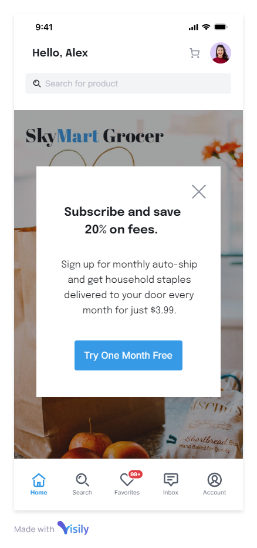
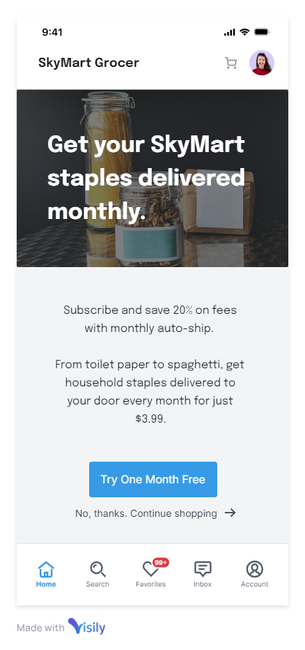

## UX Writing Challenge: Day 4
### Scenario: A user is in their favorite supermarket. They open the supermarket’s app on their phone to see what’s on sale and are greeted by a promotion.

Challenge: Write a promotional home screen for a subscription service that delivers groceries to the user once-a-month for a flat fee.

Headline: 45 characters  
Body: 175 characters max  
Button(s): 25 characters max  

## Solution
**Get your SkyMart staples delivered monthly.**  
Subscribe and save 20% on fees with monthly auto-ship by SkyMart. From toilet paper to spaghetti, we deliver household staples to your door every month for just $3.99.  

CTA1: TRY ONE MONTH FREE  
CTA2: No, thanks. Continue shopping. 

## Discussion
Why might someone want groceries delivered *automatically* so infrequently as once per month? Putting myself into the mind of a grocery shopper, I could see the value in an auto-ship subscription for pantry items, since they would likely be the same every month. But fresh meat, cheese, produce and dairy would be purchased fresh on a weekly basis. So I chose to focus on an auto-ship subscription for regular monthly household and pantry items. I created some draft copy and then modified it for space requirements in UI. 
