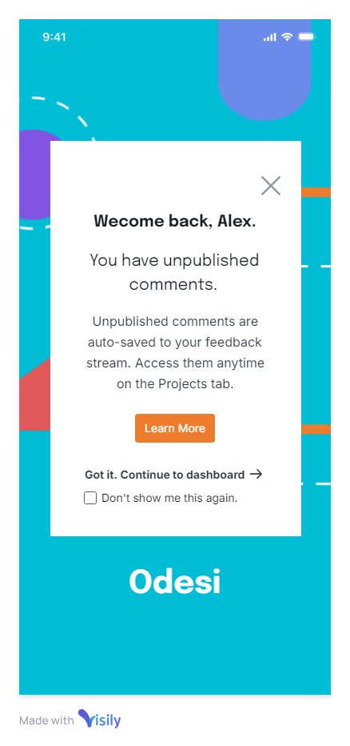

## UX Writing Challenge: Day 5
### Scenario: The user works in graphic design. While critiquing a design in a mobile app, their phone abruptly turns off. When they restart the phone, they reopen the app.

Challenge: Write a message that the user will read immediately upon opening the app. What do they need to know? What steps (if any) do they need to take to recover their content? What if they can't recover the content? 

Headline: 40 characters  
Body: 140 characters max  
Button(s): 20 characters max  

## Final Copy

CTA1: 
CTA2: 

## Solution

## Discussion

