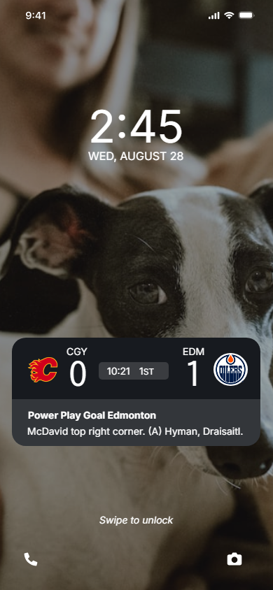

## UX Writing Challenge: Day 7
### Scenario: A sports fan is at a wedding while their favorite team is playing against their arch-rivals. Their team scores.

Challenge: How would you, quickly, let the sports fan know about the latest play, the current score, and the key players? Write it.  

Headline: 30 characters  
Body: 45 characters max    

## Final Solution  

## Discussion
I did a bit of research on existing UIs for this type of sports app widget. It helps to know which information is already in the display (such as the score, for example), which allows more space in the copy for details about the play instead of repeating the score, the time, and where they're at in the game. 
