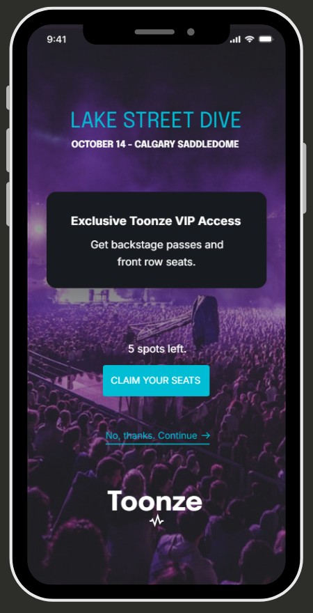

## UX Writing Challenge: Day 8
### Scenario: The user is a casual music fan and (on occasion) goes to live concerts. They have a music player app on their phone.  

Challenge: Tell the user that one of their favorite bands is playing live in their town. How would you compel them to want to go? 

Headline: 30 characters  
Body: 45 characters max   
Button: 25 characters

## Solution  

## Copy Development
V2

## Discussion
This challenge is all about the user persona. What would motivate someone to buy tickets if they don't usually attend live concerts? I tapped into some marketing techniques on this one: urgency and scarcity, otherwise known as FOMO (fear of missing out) marketing strategy. I liked the first iteration, but it was a lot of copy and was missing an escape option. 
