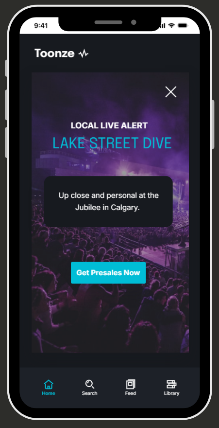

## UX Writing Challenge: Day 8
### Scenario: The user is a casual music fan and (on occasion) goes to live concerts. They have a music player app on their phone.  

Challenge: Tell the user that one of their favorite bands is playing live in their town. How would you compel them to want to go? 

Headline: 30 characters  
Body: 45 characters max   
Button: 25 characters

## Copy

**Version 1**  
Exclusive Toonze VIP Access  
Get backstage passes and front row seats. 5 spots left.  

CLAIM YOUR SEATS  

**Version 2**  
Local Live Alert. Lake Street Dive.  
Up close and personal at the Jubilee in Calgary. 

GET PRESALES NOW  

## Solutions  
   

## Discussion
This challenge is all about the user persona. What would motivate someone to buy tickets if they don't usually attend live concerts? For the first version, I tried to tap into some marketing techniques: urgency and scarcity, otherwise known as FOMO (fear of missing out) marketing strategy. I pulled the name of the band and the date/location of the concert out of the character count to allow more space for the value proposition. I liked the first iteration, but it was a lot of copy for one screen. So I played with some different ideas for the second iteration to save space and present an alternate value proposition. I like the first value proposition better, because I think it would have broader appeal. However, if the app is customizing it's value proposition based on user research, this type of music fan might be more attracted to a small venue (granted, the venue location isn't variable). 
