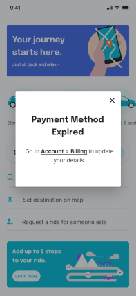
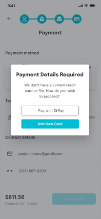

## UX Writing Challenge: Day 9
### Scenario: The user is trying to rent a car using an application but the credit card on file has expired. 

Challenge: Write them an error message so that they can correct the problem.  

Headline: 30 characters  
Body: 45 characters max   

## Solution  
  

## Iterations

## Discussion
For this challenge, I played with the copy in design, so I don't have the iteration history available here. But I did come up with a few different sets of copy and different ways to solve this challenge. The first wireframe shows the challenge solution as met within the character limits. The others are iterations that could also potentially help the user solve their problem.  

My goal for the copy in this scenario was to be specific enough that the user doesn't have to guess what the problem is, while also avoiding words that might come across as negative or accusatory. I wanted to balance between being direct with showing empathy. Instead of, for example, "your credit card is expired", I used "payment method expired." This avoids attributing blame ("your") and is slightly less conspicuous (payment method instead of credit card) without losing meaning. I wasn't sure why this challenge didn't have a CTA, but I hyperlinked some of the text in the final solution to help the user take immediate action.  

I also wasn't sure where this notification should go in the flow, but it made the most sense to me that the user be prompted to update their card on start-up, which avoids the frustration of going through the entire flow before learning they're unable to check out. I created a tooltip for the payment screen as a second option (which could serve as a reminder after the first notification), but I think it's a better user experience to serve the notification up front. I also created an alternate option for the payment screen that includes G Pay as a way for the user to immediately bypass the missing payment update prompt.  
